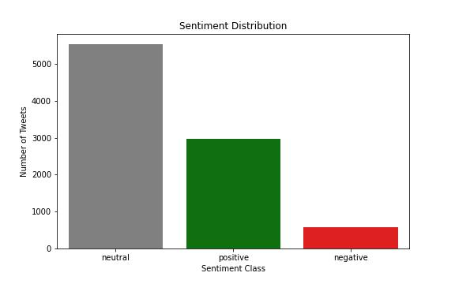
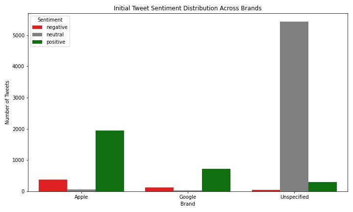
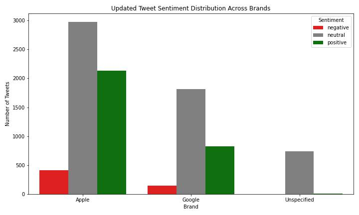
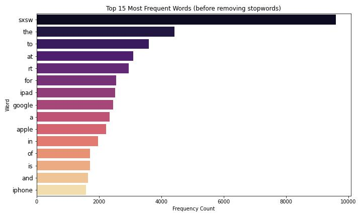
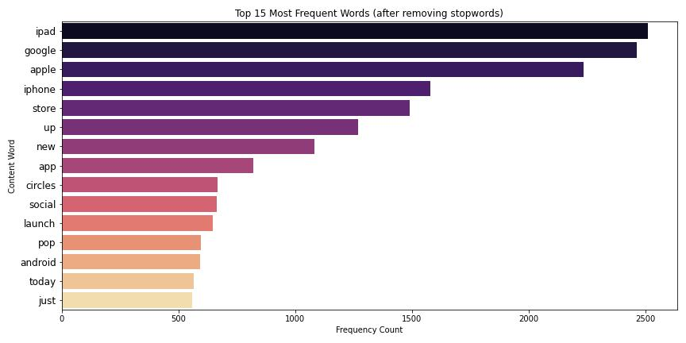
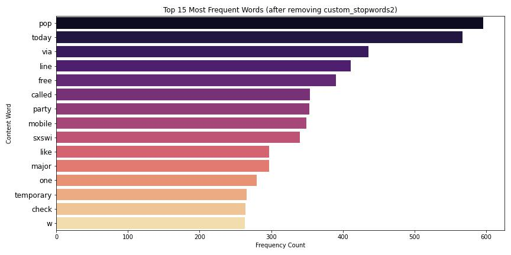
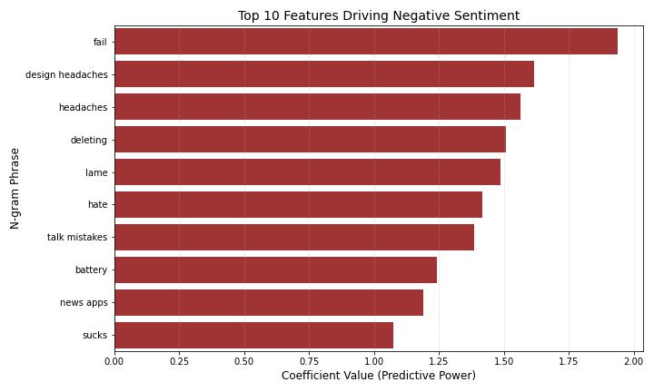
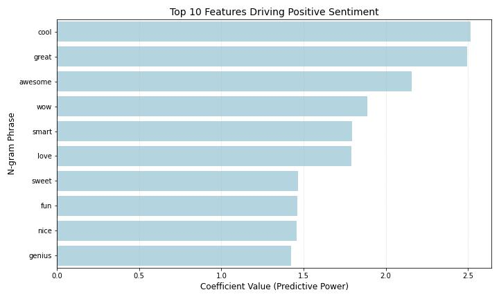

# Natural Language Processing Project: Twitter Sentiment Classification

Author: [Morgan Nash](mailto:morganmichellenash@gmail.com)

November 2025

See the full analysis in the [Jupyter Notebook](notebook.ipynb) 

# Introduction

This project uses Natural Language Processing (NLP) and Classification Methods to predict the sentiment of a Tweet based on its content.

# Business Understanding

The presence of social media today allows for constant real-time communication which can present issues for companies to deal with. [Twitter](https://x.com/), now X, is one of the largest social media platforms where users' short messages are posted in real-time. One negative tweet could quickly blow up into a company's PR nightmare if left untouched. Ineffective monitoring of what's being said about a company online can lead to slow crisis response, missed customer service opportunities, and permanent brand damage. A classification model is necessary to filter out the noise and help to automate some of this process.

## Objective:
Monitoring tweets manually would be impossible. The main goal of this project is to build an NLP classification model that acts as a screening system to categorize incoming online text into sentiment classes (negative, neutral, or positive). We prioritize the negative category, as it carries the highest risk. The model's primary features are the raw tweet text, and the mulit-class target is the sentiment. Once the model labels a tweet as negative, human teams can intervene and address them before they escalate, preventing minor complaints from growing into major public relations crises.

### Stakeholders:

The final model acts as a first-pass filtering system that can help several important company teams:

**Customer Service Teams** can jump on a addressing negative tweets, rather than leaving them to get more attention.

**Marketing Teams** can use the findings to figure out what people are saying about the company brand. They can also use the positive tweets for promotion.

# Data Understanding

The dataset used for this project comes from [CrowdFlower Open Source Datasets](https://data.world/crowdflower/brands-and-product-emotions) and contains over 9000 tweets from 2013 that reference Apple or Google products. The tweets were related to the [South by Southwest festival (SXSW)](https://www.sxsw.com/) and were rated by humans as to whether the tweets expressed positive, negative, no emotion towards a brand or product, or they couldn't tell. I combined the 'no emotion..' and 'can't tell' into a 'neutral' sentiment. The dataset originally contained 3 columns which I renamed for clarity: tweet, product_name, and sentiment.

## Limitations:
This data is limited as it is an unbalanced collection of tweets about a focused topic and is from 2013. This project establishes a classification model. Its accuracy and ability to generalize can be further refined over time with more labeled data, ensuring it would remain effective as online language and sentiment patterns evolve. Sentiment is not always black and white, even humans can have a hard time picking out a sentiment from tweets without more context. The scope of this project includes model classification and evaluation. It does not include the engineering of a live, real-time alerting system.

### Sentiment Distribution:

The target 'sentiment' class is imbalanced:

Neutral  60.98%

Positive 32.75%

Negative  6.27%

# Exploratory Data Analysis:
The dataset contributors were only asked to fill in the product_name column if there was a positive or negative emotion found in the tweet. This meant that there were still product or brand information in the neutral tweets. I created a function to loop through the rows with the brand currently "unspecified" and look for brands in those tweets to update the brand column. The following plots are the Sentiment Distribution Among Brands before and after updating the Brand column:

## Data Preparation:

To prepare the data, I performed basic cleaning including removal of duplicates, removal of null values, renamed columns for clarity and standardized the text case. I used Regex patterns to remove hashtags, urls, htmls, punctuation, etc. 

### Stopwords:
I created two custom stopwords lists. The first included certain words from NLTK's 'english' list and a couple of dataset specific words. The second was more extensive, combining the entire 'english' stopwords list from NLTK with more sentiment-neutral topic noise words like 'apple' and 'google'. Excluding these words from the features helped the model to ignore some of the noise. The following plots show the most frequent words 1. before removing any stopwords, 2. after removing the first, short list of stopwords, and 3. after removing the more extensive list of stopwords. 

I also used word_tokenize from NLTK to tokenize the text data for further exploratory analysis.

# Modeling:
My approach to sentiment classification began by running a dummy model to use as a sanity check/baseline to ensure any future model produces better results. Then I selected a range of vectorizers and classifiers to maximize the chances of finding the best model for this imbalanced dataset. The "best" combination in this context would, hopefully, produce a high F-1 score, and a high Negative Recall score.

I chose to test out two kinds of vectorizers. For each of these vectorizers, I used both lists of custom stopwords. (4 total Vectorizers)

- **CountVectorizer:** counts how many times a word or phrase appears and is good for simple, linear models
- **TfidfVectorizer:** counts words and weights them by their uniqueness, and proves to be more effective for more complex models that need to isolate rare, predictive words

I decided to test a variety of different types of classifiers (6 in total):

- Linear and Probability Models: **Logistic Regression, LinearSVC, and MultinomialNB** models were used to establish baselines, as they are fast and interpretable, especially with high-dimensional text data. These models draw a straight line or plane to separate positive tweets from negative ones.

- Complex Pattern Models: **Decision Tree and Random Forest** models were chosen to explore non-linear relationships, aiming to capture complex sentiment rules that simple linear models might miss. These models can find unique patterns but they carry the risk of overfitting.

- Distance-Based Model: **K-Nearest Neighbors** would classify a new tweet based on the sentiment of the closest similar tweets already seen. A KNN model would generally not be the ideal or best-performing model for text, but I wanted to check the initial results.

I then created a for loop that creates pipelines and tests each vectorizer with each model and compared the results, allowing me to determine the model that was the most capable of maximizing the Negative F1-Score in the presence of class imbalance.

Finally, I chose to tune the hyperparameters of one of the LinearSVC models, attempting to improve results before selecting the final model.

### Rationale for Evaluation Metrics:
I chose to use the **Negative F1-Score** as my main evaluation metric as it is a compromise between the model's ability to find negative tweets (Recall) and its ability to be correct when it does so (Precision). F1-Score is a good metric when evaluating performance on an imbalanced class because it requires the model to perform well on both measures simultaneously.

## Initial Model Results: 
The dummy baseline model had an F1-Score of 0% for the target negative class and an Accuracy of 61%. All of the vectorizer and classifier combinations produced significantly better results, although there's still plenty of room for improvement.

Top 5 Models (ranked by the critical Negative F1-Score):

CountVectorizer2 + DecisionTreeClassifier: Neg_F1 of 33.6%

TfidfVectorizer2 + DecisionTreeClassifier: Neg_F1 of 31.9%

TfidfVectorizer2 + LinearSVC: Neg_F1 of 31.8%

TfidfVectorizer + LinearSVC: Neg_F1 of 31.5%

CountVectorizer + LinearSVC: Neg_F1 of 29.9%

**Key Finding:** All of the top three models use a vectorizer that uses the more comprehensive stopword list ("Vectorizer"2), which removed both general English words and high-frequency dataset specific words like 'apple' and 'google'. This confirms that eliminating topic-related noise is crucial for improving the Negative F1-Score, as it forces the models to focus on the true sentiment signals.

The LinearSVC models consistently achieved higher Negative F1-Scores (up to 31.8%), confirming their strength in handling high-dimensional text data.

As anticipated, the K-Nearest Neighbors (KNN) models performed poorly compared to the linear and tree-based models. This confirms that distance-based models would not be an appropriate approach.

## Model Selection for Tuning:¶
The model combination that I selected for hyperparameter tuning was the model using TfidfVectorizer2 + LinearSVC. Although the top 2 models used the DecisionTreeClassifier, I believe the LinearSVC is a better choice to move forward with as it is less complex and less prone to overfitting.

LinearSVC models are better performers with sparse, high-dimensional data as compared to Decision Trees. A slightly different set of features could result in an entirely different Decision Tree structure, making the Decision Tree model less reliable.

For this filter system designed to alert people to negative tweets, reliability is so important. A slight difference in the Negative F1-Score is a small price to pay for the massive increase in stability and predictability that the LinearSVC model would provide.

## Hyperparameter Tuning Steps:
I decided to tune the TfidfVectorizer2 + LinearSVC model using class_weight='balanced' to address the high class imbalance and try various values of the regularization parameter C to optimize generalization.

Setting **class_weight='balanced'** tells the LinearSVC to assign a higher penalty to misclassifying the minority classes and a lower penalty to misclassifying a common neutral tweet. This forces the model to work harder to learn the distinct patterns of the crisis-alerting negative sentiment, with the goal of increasing Negative Recall.

The **'C' parameter** controls the model's complexity and ability to generalize to unseen data. A smaller C = stronger regularization which forces the model to be simpler, prioritizing a wider margin between the classes. This reduces the risk of overfitting the training data and generally improves performance on the test set. A larger C = weaker regularization which allows the model to become more complex, prioritizing a perfect fit to every single training point.

# Evaluation of Tuned, Final Model:
The hyperparameter tuning successfully improved the TfidfVectorizer2 + LinearSVC model. Our final model achieved a Negative F1-Score of 38% (up from 31.8%) with an overall accuracy of 68%.

Unfortunately, our model in its current form did not perform as well as we had hoped. The model’s Negative Precision hit 50% which means when the model flags a ‘Negative’ tweet, it's correct half the time which cuts the false alarm rate in half. However, the model's Recall for Negative Tweets is only at 30% which means that while we do catch some "fires", we are still missing 7 out of every 10 true negative tweets. This score, along with the overall 68% accuracy, tells us that while the model is useful as a First-Pass Filter, it is not a perfect, autonomous solution and still requires human supervision.

# Conclusion:
The final model's performance on the unseen test data achieved a Negative F1-Score of 38% (up from 31.8% before tuning) with an overall accuracy of 68%. The final metrics are not as strong as initially desired, but still can be valuable as a first-pass filter. This final model is a good foundation that should be updated and refined with even more data and further parameter tuning, especially addressing class imbalance.

# Additional Findings:

## Next Steps: # Next Steps: 
There are still improvements to be made before the model could be used as a fully automated tool. We recommend the following 
1. **Increase Recall:** Explore advanced techniques to overcome the class imbalance (i.e. synthetic data generation, oversampling the minority) As well as explore additional preprocessing steps like lemmatization. The main goal of next steps is to help the model catch more than 30% of true 'negative' tweets.
2. **Acquire More Data:** This project uses a dataset from 2013 which is quite outdated. Collect a larger dataset with more recent data and retrain the model.
3. **Immediate Deployment and Expansion:** Use the model in its current form to provide immediate value as a First-Pass Filter in to monitor and confirm its performance in a live data environment.

**Proactive Opportunity:** Adapt the model's to pay attention the Positive class to identify positive traction for proactive marketing and engagement. This would transitioning the model from a defensive measure to a proactive asset.

## For More Information

See the full analysis in the [Jupyter Notebook](notebook.ipynb) 
